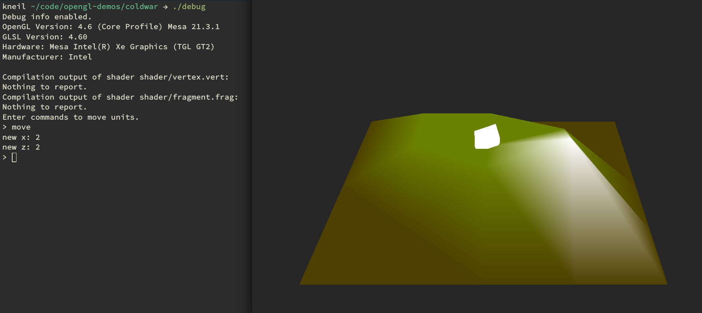

# coldwar
a simple RTS game with units that move around!

## Prompt Commands
 - "move": moves unit to a new space
 - "exit": exits the game

## Example Output

## TODOs
0. make a simple command prompt
	be able to load and move units
1. load maps from disk
2. add better lighting to discern model features
3. add unit animations

