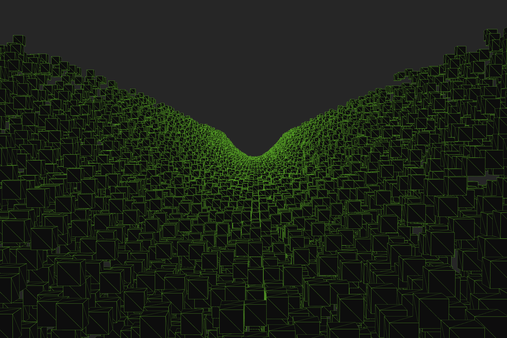

# trench

A trench run demo program.

## Controls
Use the A and D keys to move left and right and the left shift and spacebar keys to move up and down.  The mouse controls where you look.
  
Press the tab key to turn off wireframes and make everything dark.

## Example Output

